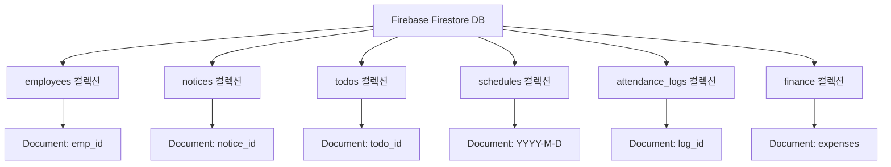

# 📁 Firebase 마이그레이션용 데이터 구조 및 연동 가이드

본 디렉토리(`data/`)는 기존 자바스크립트 코드 내 하드코딩되어 있던 그룹웨어의 모든 목업 데이터를 **구글 파이어베이스(Firebase Firestore / Realtime DB / Data Connect)** 입력을 위해 체계적으로 분리 및 구조화한 데이터 패키지입니다.

---

## 📂 1. 데이터 파일 구성

| 파일명 | 파이어베이스 컬렉션 (Collection) | 주요 포함 데이터 및 설명 |
| :--- | :--- | :--- |
| `employees.json` | `employees` | 전사 임직원 21명의 기본 정보 (이름, 부서, 직급, 전화번호, 이메일, 아바타, 상태) |
| `notices.json` | `notices` | 사내 공지사항 목록 (제목, 카테고리, 상단고정 여부, 작곡자, 본문 HTML, 첨부파일) |
| `todos.json` | `todos`, `trashed_todos` | 할 일 관리 데이터 (제목, 프로젝트명, 상태, 우선순위, 마감일, 담당자, 메모, 휴지통 항목) |
| `schedules.json` | `schedules` | 날짜별(YYYY-M-D) 일정 데이터 (제목, 시간, 구분 타입, 배지, 작성자) |
| `holidays.json` | `holidays`, `observances` | 고정 국경일, 2026년 대체공휴일, 월별 기념일 및 24절기 데이터 |
| `attendance_logs.json` | `attendance_logs`, `attendance` | 출퇴근 및 근무시간 히스토리 기록, 본사 GPS 좌표 및 유효 반지름(500m) |
| `finance.json` | `finance` | 법인카드/개인카드 경비 지출 미결의 내역 및 결재 항목 |
| `firebase-seed.json` | *(통합 시드 데이터)* | 파이어베이스 콘솔 업로드 및 원클릭 자동 시딩 전용 통합 JSON 파일 |
| `firebase-seeder.js` | *(자동 시딩 유틸리티)* | Firebase Web SDK를 사용하여 Firestore로 데이터를 일괄 배치 업로드하는 JS 함수 모듈 |

---

## 🔥 2. 구글 파이어베이스 (Firestore) 데이터베이스 컬렉션 구조



### 컬렉션별 필드 상세 스키마

#### `employees` (임직원)
- `id` (number/string): 임직원 고유 ID
- `name` (string): 성명
- `dept` (string): 소속 부서명
- `role` (string): 직책/직급 (대표, 본부장, 차장, 과장, 대리, 주임, 사원 등)
- `phone` (string): 휴대전화번호
- `tel` (string): 사내 내선전화
- `email` (string): 회사 이메일 주소
- `avatar` (string): 프로필 이미지 경로
- `status` (string): 접속/근무 상태 (`active`, `online`, `offline`)

#### `notices` (공지사항)
- `id` (number/string): 공지 고유 ID
- `title` (string): 공지 제목
- `category` (string): 카테고리 (`인사`, `복지`, `시스템`, `공통`)
- `date` (string): 작성일자 (YYYY.MM.DD)
- `isPinned` (boolean): 필독 상단 고정 여부
- `isNew` (boolean): 신규 공지 여부
- `author` (string): 작성 부서/작성자
- `summary` (string): 공지 한줄 요약
- `content` (string): 공지 상세 본문 (HTML 형식)
- `fileName` (string): 첨부파일 파일명
- `fileSize` (string): 첨부파일 용량

#### `todos` (할 일 관리)
- `id` (number/string): 할 일 고유 ID
- `title` (string): 할 일 제목
- `project` (string): 프로젝트명
- `status` (string): 상태 (`todo`, `in_progress`, `done`, `draft`)
- `priority` (string): 우선순위 (`high`, `medium`, `low`)
- `dueDate` (string): 마감일시
- `assignees` (array): 담당자 배열 `[{ name, avatar }]`
- `notes` (string): 상세 메모 내용

#### `schedules` (일정)
- 문서 ID: `2026-8-14` (YYYY-M-D 형식)
- `items` (array):
  - `title` (string): 일정 제목
  - `time` (string): 시간 (`종일` 또는 `13:00 ~ 18:00`)
  - `type` (string): 배지 스타일 톤 (`primary`, `secondary`, `warning`, `error`)
  - `badge` (string): 일정 카테고리 (`연차`, `반차`, `외근`, `공휴일` 등)
  - `author` (string): 작성자 이름

---

## ⚡ 3. 파이어베이스 연동 시 자동 시딩(Seeding) 방법

웹 앱 내에서 Firebase 앱을 초기화한 후, 포함된 `firebase-seeder.js` 모듈을 실행하여 데이터를 한 번에 입력할 수 있습니다.

```javascript
import { initializeApp } from "firebase/app";
import { getFirestore } from "firebase/firestore";
import { seedFirebaseFirestore } from "./data/firebase-seeder.js";

// 1. Firebase 프로젝트 설정
const firebaseConfig = {
  apiKey: "YOUR_API_KEY",
  authDomain: "YOUR_PROJECT.firebaseapp.com",
  projectId: "YOUR_PROJECT_ID",
  storageBucket: "YOUR_PROJECT.appspot.com",
  messagingSenderId: "SENDER_ID",
  appId: "APP_ID"
};

// 2. 초기화 및 Firestore 객체 생성
const app = initializeApp(firebaseConfig);
const db = getFirestore(app);

// 3. 데이터 일괄 배치 생성 실행
await seedFirebaseFirestore(db);
```
